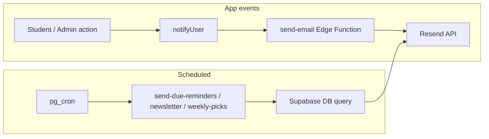

# Resend Email Setup — Biblioteca TC

Step-by-step guide to connect **Resend** with Supabase Edge Functions.

**Production sender:** `BibliotecaTC <noreply@bibliotecatc.com>`

---

## 1. Resend domain

1. [resend.com](https://resend.com) → **Domains** → add `bibliotecatc.com`
2. Add DNS records (SPF, DKIM) until status is **Verified**
3. **API Keys** → create key with **Sending access** → copy `re_...`

---

## 2. Supabase secrets

**Dashboard → Project Settings → Edge Functions → Secrets**

| Secret | Value |
|--------|--------|
| `RESEND_API_KEY` | `re_...` |
| `RESEND_FROM` | `BibliotecaTC <noreply@bibliotecatc.com>` (optional; this is the default) |
| `OPENAI_API_KEY` | For AI newsletter text (optional) |
| `APP_BASE_URL` | `https://bibliotecatc.com` (optional) |

`SUPABASE_URL` and `SUPABASE_SERVICE_ROLE_KEY` are usually auto-available to Edge Functions.

See also: [supabase/SECRETS.md](./supabase/SECRETS.md)

---

## 3. Deploy Edge Functions

```bash
npx supabase login
npx supabase link --project-ref YOUR_PROJECT_REF

npx supabase functions deploy send-email --no-verify-jwt
npx supabase functions deploy send-due-reminders
npx supabase functions deploy send-newsletter
npx supabase functions deploy send-weekly-picks
```

---

## 4. Manual test (before cron)

**Dashboard → Edge Functions → Invoke**

| Function | Body |
|----------|------|
| `send-email` | `{"to":"you@agr-tc.pt","subject":"Test","html":"<p>OK</p>"}` |
| `send-due-reminders` | `{}` |
| `send-newsletter` | `{}` |
| `send-weekly-picks` | `{}` |

Check **Logs** and Resend → **Emails**.

---

## 5. App-triggered emails (no cron)

These call `send-email` from the browser via [`src/lib/sendEmail.js`](src/lib/sendEmail.js):

| Event | When |
|-------|------|
| Reservation pending | Student requests a book |
| Approved / Rejected / Returned | Admin updates loan in `/console/emprestimos` |

---

## 6. Automatic emails (pg_cron)

| Function | Schedule (UTC) | What it does |
|----------|----------------|--------------|
| `send-due-reminders` | Daily 08:00 | Email + in-app notification for loans due **tomorrow** |
| `send-newsletter` | Mon–Fri 08:20 | Fun facts to students (`newsletter_preferences`) |
| `send-weekly-picks` | Monday 09:00 | Featured book recommendation |

**Setup:** edit and run [`supabase/setup_email_cron.sql`](supabase/setup_email_cron.sql) in SQL Editor (replace `YOUR_PROJECT_REF` and `YOUR_SERVICE_ROLE_KEY`).



---

## 7. Vercel (frontend only)

- `VITE_SUPABASE_URL`
- `VITE_SUPABASE_ANON_KEY`
- `VITE_OPENAI_API_KEY`

Do **not** put `RESEND_API_KEY` in Vercel.

---

## Troubleshooting

| Problem | Fix |
|---------|-----|
| Domain not verified | Resend → Domains; wait for DNS |
| Wrong sender | Set `RESEND_FROM` secret or update `_shared/resend.ts` |
| Cron never runs | Run `setup_email_cron.sql`; check `SELECT * FROM cron.job` |
| `send-due-reminders` sent 0 | No active loans with `due_date` = tomorrow |
| Duplicate reminders | UI auto-reminder removed; only cron sends daily reminders |
