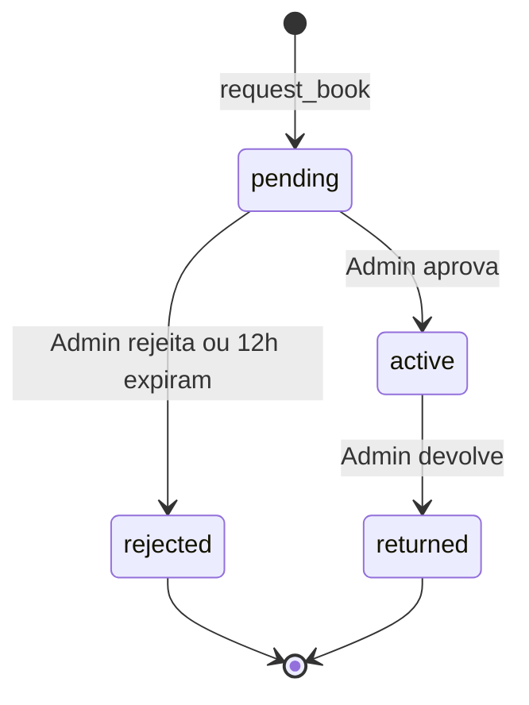

# Biblioteca TC — Resumo Técnico

Visão geral da stack, backend Supabase, automações e módulos do frontend. Complementa a descrição de produto em **[Doc.md](./Doc.md)**.

---

## Stack

| Camada | Tecnologia |
|--------|------------|
| Frontend | React 19, Vite 8, React Router 7 |
| Estilos | Tailwind CSS v4 (`@tailwindcss/vite`), design tokens em `src/index.css` |
| Animações | Framer Motion |
| Backend / Auth / DB | Supabase (PostgreSQL, Auth, Storage, Edge Functions) |
| Email | Resend via Edge Function `send-email` |
| IA (resumos) | OpenAI API (`gpt-4o-mini`), chamada no cliente com `VITE_OPENAI_API_KEY` |

**Scripts npm:** `dev`, `build`, `preview`, `lint`, `optimize-slides` (gera WebP/JPEG em `public/media/slides/`).

---

## Variáveis de ambiente (`.env`)

| Variável | Uso |
|----------|-----|
| `VITE_SUPABASE_URL` | URL do projeto Supabase |
| `VITE_SUPABASE_ANON_KEY` | Chave pública do cliente |
| `VITE_OPENAI_API_KEY` | Geração de resumos IA no detalhe do livro |

**Edge Function `send-email`:** `RESEND_API_KEY` (definida no dashboard Supabase, não no `.env` do Vite).

---

## Base de dados (Supabase / PostgreSQL)

Tabelas usadas pela aplicação (nomes e relações inferidos do código; o SQL completo de migrações pode viver apenas no projeto Supabase).

### `profiles`

- `id` (UUID, ligado a `auth.users`)
- `name`, `email`, `full_name`
- `role`: `aluno` | `admin` — `isAdmin` no frontend = `profile.role === 'admin'`

Criação automática em `AuthContext` se o perfil não existir após login.

### `books`

- Metadados: título, autor, ISBN, editora, ano, descrição, `category_id`
- Inventário: `quantity`, `available_qty`
- `cover_image` (path no Storage)
- `is_featured` (secção Recomendados)
- `ai_summary` (texto gerado por IA)
- Join com `categories(name)` no carregamento do catálogo

### `categories`

- `name`, `display_order` (reordenação na consola)

### `loans`

| Campo | Descrição |
|-------|-----------|
| `user_id`, `book_id` | FKs para `profiles` e `books` |
| `status` | `pending` → `active` → `returned` ou `rejected` |
| `created_at` | Início do pedido / base para expiração de 12 h |
| `due_date` | Definida na **aprovação** (+15 dias) |
| `returned_at` | Na devolução |
| `fine_amount` | `5` se devolução após `due_date`, senão `0` |

FKs nomeadas no código: `fk_loans_book`, `fk_loans_user`.

### `notifications`

- `user_id`, `title`, `message`, `type` (`info` | `success` | `warning` | `error`), `read`

### `feedback`

- `user_id`, `message` (enviado em Definições)

### `reviews`

Script de referência: [`scripts/create_reviews_table.sql`](scripts/create_reviews_table.sql)

- `book_id`, `user_id`, `rating` (1–5), `comment`
- `UNIQUE(book_id, user_id)` — uma avaliação por utilizador por livro
- RLS: leitura pública; insert/update/delete apenas pelo próprio utilizador

---

## Storage (Supabase)

| Bucket | Uso |
|--------|-----|
| `capalivro` | Capas dos livros (`cover_image`) |
| `logo` | Logo em emails HTML |

URLs públicas via `supabase.storage.from('capalivro').getPublicUrl(...)`.

---

## Funções e automações importantes

### `request_book` (RPC PostgreSQL)

Chamada em [`src/pages/BookDetails.jsx`](src/pages/BookDetails.jsx):

```js
supabase.rpc('request_book', { p_book_id: id, p_user_id: user.id })
```

- Resposta esperada: `{ success, message }`
- Em sucesso: cria empréstimo **pendente** e **reduz** `available_qty` de forma atómica no servidor
- O frontend atualiza estado local e chama `notifyUser()` com aviso das **12 horas** para levantamento

> A definição SQL desta RPC não está versionada neste repositório; existe no SQL Editor / migrações do projeto Supabase.

### Expiração de reservas após 12 horas

**Regra:** pedidos `pending` criados há mais de **12 horas** passam a `rejected` e o stock é reposto.

**Implementação no repositório** ([`src/pages/admin/ManageLoans.jsx`](src/pages/admin/ManageLoans.jsx)) — comentário no código: *"Frontend fallback for pg_cron"*:

1. Ao carregar a lista de empréstimos na consola, filtra `pending` com `now - created_at > 12h`
2. `UPDATE loans SET status = 'rejected'` em lote
3. Para cada um, incrementa `books.available_qty`
4. Recarrega a lista

Pode existir também um job **`pg_cron`** no Supabase (não versionado aqui) para executar a mesma lógica sem abrir a consola.

### Aprovação / rejeição / devolução (admin)

[`ManageLoans.jsx`](src/pages/admin/ManageLoans.jsx) — `updateLoanStatus`:

| Novo estado | Efeitos |
|-------------|---------|
| `active` | `due_date` = agora + **15 dias**; email de aprovação |
| `rejected` | Repõe `available_qty`; email de rejeição |
| `returned` | `returned_at` = agora; multa **5 €** se `due_date` ultrapassada; repõe stock; email de confirmação |

### Lembretes de devolução

Edge Function **`send-due-reminders`** (pg_cron diário 08:00 UTC): email + notificação in-app para empréstimos **ativos** com `due_date` **amanhã**. Configuração: [`supabase/setup_email_cron.sql`](supabase/setup_email_cron.sql).

### `notifyUser` ([`src/lib/sendEmail.js`](src/lib/sendEmail.js))

1. `INSERT` em `notifications`
2. `supabase.functions.invoke('send-email', { to, subject, html })`

### Edge Function: `send-email`

[`supabase/functions/send-email/index.ts`](supabase/functions/send-email/index.ts)

- POST para API Resend
- Remetente: `BibliotecaTC <noreply@bibliotecatc.com>`
- CORS habilitado para invocação do browser

### Resumo IA (OpenAI)

- Cliente: `fetch` a `https://api.openai.com/v1/chat/completions`
- Modelo: `gpt-4o-mini`
- Persistência: `books.ai_summary`

### Registo de alunos

[`Signup.jsx`](src/pages/Signup.jsx): validação `^al\d{5}@agr-tc\.pt$`; perfil com `role: 'aluno'`.

### Google OAuth

[`AuthContext.jsx`](src/context/AuthContext.jsx): `hd: 'agr-tc.pt'`, `prompt: 'select_account'`.

---

## Estados do empréstimo



---

## Frontend — arquitetura

### Routing

[`src/App.jsx`](src/App.jsx) — rotas standalone (auth) vs `DashboardLayout` (app + admin aninhado).

### Contextos

| Contexto | Ficheiro | Responsabilidade |
|----------|----------|------------------|
| `AuthProvider` | `AuthContext.jsx` | Sessão Supabase, perfil, `isAdmin`, OAuth |
| `LibraryDataProvider` | `LibraryDataContext.jsx` | Catálogo global (`books`, `categories`), `loadCatalog`, `getBookById` |
| `NotificationProvider` | `NotificationContext.jsx` | Toasts, modais de confirmação |
| `LanguageProvider` | `LanguageContext.jsx` | i18n (`t`, `translateCategory`) |

### Cache cliente ([`src/lib/libraryCache.js`](src/lib/libraryCache.js))

- Catálogo: memória + `sessionStorage`, TTL **5 minutos**
- Livro individual por id (prefetch / navegação com `state: { book }`)
- `invalidateCatalog()` após mutações admin

### Paginação do catálogo

[`src/pages/Home.jsx`](src/pages/Home.jsx) + [`CatalogPagination.jsx`](src/components/ui/CatalogPagination.jsx)

- `CATALOG_PAGE_SIZE = 20`
- `effectivePage = min(catalogPage, totalPages)` evita grelha vazia ao mudar filtro estando na página 2

### Proteção de rotas

- [`ProtectedRoute.jsx`](src/components/ProtectedRoute.jsx) — exige utilizador (ex.: `/emprestimos`)
- [`AdminProtectedRoute.jsx`](src/components/AdminProtectedRoute.jsx) — exige `isAdmin`

### Componentes UI relevantes

`Button`, `Chip`, `Input`, `Select`, `TopBar`, `Sidebar`, `BookCard`, `AboutSlideshow`, `PageContainer`, `SectionHeader`, etc.

### Assets estáticos

- `public/assets/` — logos
- `public/media/` — hero (`IMG_3340.MOV`), slides originais
- `public/media/slides/` — WebP/JPEG otimizados (~1600px) para a landing

---

## Segurança e RLS

- Autenticação via **Supabase Auth** (JWT no cliente).
- Operações sensíveis de stock e requisição delegadas à RPC **`request_book`** (evita race conditions no cliente).
- **`reviews`**: políticas RLS documentadas no script SQL.
- Chave Resend e lógica de email **não** expostas no bundle — apenas na Edge Function.

---

## Ficheiros úteis para manutenção

| Ficheiro | Conteúdo |
|----------|----------|
| [`Doc.md`](./Doc.md) | Páginas e fluxos de produto |
| [`scripts/create_reviews_table.sql`](scripts/create_reviews_table.sql) | DDL + RLS de avaliações |
| [`scripts/optimize-about-slides.mjs`](scripts/optimize-about-slides.mjs) | Otimização de imagens da landing |
| [`supabase/config.toml`](supabase/config.toml) | Config local Supabase CLI |
| [`src/locales/pt.js`](src/locales/pt.js) | Strings de referência (PT) |

---

## Deploy / build

```bash
npm install
npm run build    # output em dist/
npm run preview  # pré-visualização estática
```

Variáveis `VITE_*` devem estar definidas no ambiente de build (Vercel, Netlify, etc.). Edge Functions e secrets Resend configurados no projeto Supabase.
